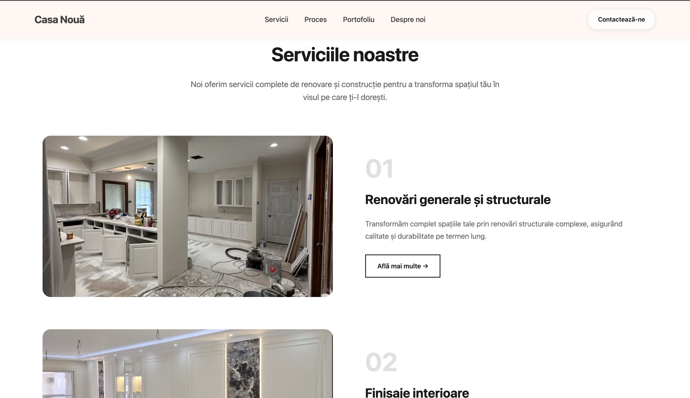

# Casa Nouă - Renovation Company Landing Page

A modern, responsive landing page for a professional renovation and construction company based in Moldova. The website showcases services, process workflow, portfolio, and company information with an elegant beige color scheme and smooth interactions.

## 🎯 Project Overview

This landing page is designed for "Casa Nouă" (New Home), a renovation company specializing in:
- General and structural renovations
- Interior finishes
- Electrical and plumbing installations
- Flooring and carpentry installation

## ✨ Features

- **Responsive Design** - Fully responsive layout that works on all devices
- **Interactive Hero Section** - Animated text reveal with background image
- **Services Section** - Detailed modal popups for each service with tasks and benefits
- **Interactive Process Flow** - Visual representation of the renovation process with hover effects
- **Portfolio Gallery** - Masonry-style grid with lightbox functionality
- **About Section** - Company information with key features
- **Contact Footer** - Complete contact information and quick navigation

## 🛠️ Technologies Used

- **HTML5** - Semantic markup
- **CSS3** - Modern styling with Grid and Flexbox
- **Vanilla JavaScript** - For interactive modals, lightbox, and animations
- **System Fonts** - Clean typography with no external dependencies

## 📸 Screenshots

### Hero Section

*Animated hero section with compelling headline and call-to-action buttons*

### Services with Modal

*Service cards with detailed modal popups*

### Interactive Process Flow

*Visual process representation with interactive hover states*

### Portfolio Gallery

*Masonry-style portfolio with lightbox image viewer*

### About Section

*Company information with key features*

## 🚀 Live Demo

**[View Live Demo](#)** *(https://drive.google.com/file/d/1gEFq_VBaLyIS6O49Qokg8yrhPQGrfVUN/view?usp=drive_link)*

## 📂 Project Structure

```
tum-web-lab2/
├── index.html          # Main HTML file
├── style.css           # Complete styling
├── reset.css           # CSS reset
├── photos/             # Image assets
│   ├── background.png
│   ├── service1-4.png
│   ├── process.png
│   ├── portfolio1-6.jpg
│   ├── about.jpg
│   └── right-up.png
└── README.md           # This file
```

## 🎨 Color Palette

- **Primary Beige**: `#f5e6d3`, `#f0dfc9`, `#fff4efc1`
- **Brown Accents**: `#8b6f47`, `#9b6250`, `#73594d`
- **Text**: `#1a1a1a`, `#333`, `#666`
- **Background**: `#ffffff`

